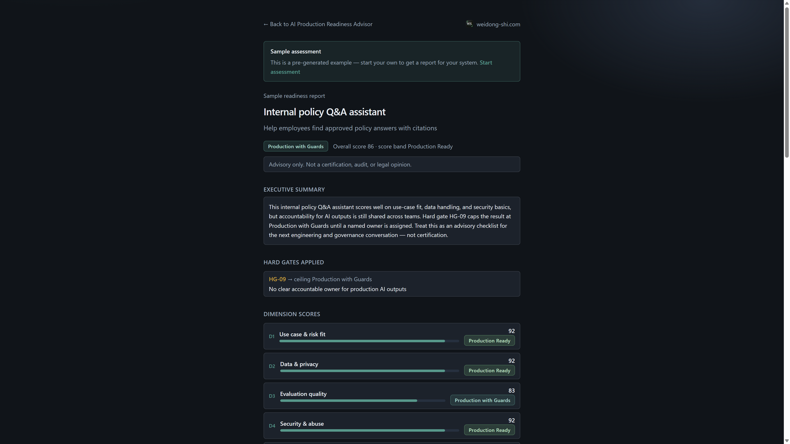
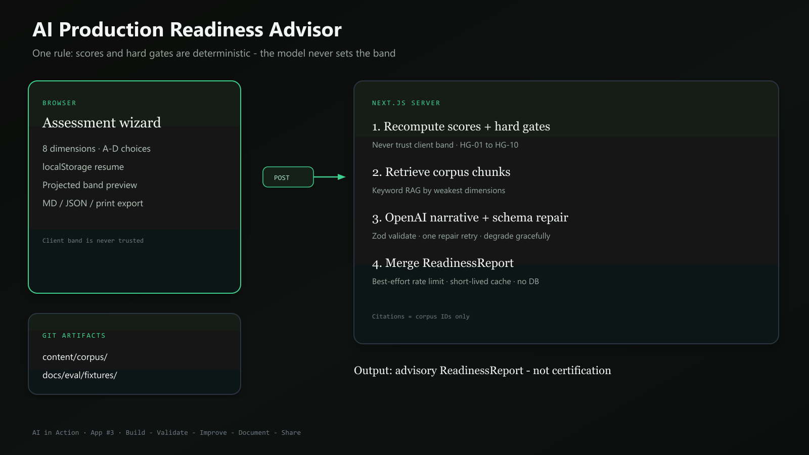

# AI Production Readiness Advisor

Guided assessment tool that helps engineers and architects evaluate whether an AI feature or system is ready for production — with structured scores, hard gates, and an evidence-backed advisory narrative.

[](https://github.com/weidong808/ai-production-readiness-advisor/actions/workflows/ci.yml)

| | |
|--------|--------|
| **Series** | [AI in Action](https://weidong-shi.com) · App #3 |
| **Public roadmap** | [ai-in-action-roadmap](https://github.com/weidong808/ai-in-action-roadmap) |
| **Status** | Live |
| **Owner** | Weidong Shi |
| **Live demo** | https://readiness.weidong-shi.com |
| **Privacy** | https://readiness.weidong-shi.com/privacy |
| **Hub case study** | https://weidong-shi.com/work/readiness |
| **Hub insight** | https://weidong-shi.com/insights/ai-in-action-readiness |
| **Vercel alias** | https://ai-production-readiness-advisor.vercel.app |
| **GitHub** | https://github.com/weidong808/ai-production-readiness-advisor |



*Cold-start sample report — band, hard gates, and dimension scores (zero OpenAI cost).*

## What this is

An educational portfolio application that demonstrates:

- Structured AI product assessment (deterministic scoring + LLM narrative)
- Hard-gated readiness bands
- Curated corpus retrieval + citation hygiene
- Evaluation fixtures for scoring and narrative safety
- Cost and privacy discipline for LLM features

**Philosophy:** Build → Validate → Improve → Document → Share

**One rule:** scores and hard gates are deterministic and recomputed on the server; the model never sets the band.

## What this is not

- Not a compliance certification or audit substitute
- Not legal, security, or regulatory advice
- Not a commercial product catalog entry

## Architecture



*Browser-held answers → server recompute → optional OpenAI narrative → merged advisory report.*

Supporting diagrams:

- [Scoring & hard gates](docs/diagram-scoring-gates.png) · [SVG](docs/diagram-scoring-gates.svg)
- [Engineer / AI Assistant](docs/diagram-human-ai.png) · [SVG](docs/diagram-human-ai.svg)
- Full write-up: [docs/architecture/architecture.md](docs/architecture/architecture.md)

## Demo script (local)

1. Copy env and install:

```bash
cp .env.example .env
# put OPENAI_API_KEY in .env only
npm install
npm run dev
```

2. Open the app (port may be `3001` if `3000` is busy):  
   [http://localhost:3000](http://localhost:3000) → **Start assessment**

3. Happy path (~10–15 min):
   - Context: internal assistive tool, production target  
   - Answer dimensions mostly **A/B**  
   - Review projected band → open full report  
   - Confirm executive summary, risks, remediation, citations  
   - Export Markdown / JSON (both include the advisory disclaimer)

4. Guardrail path (optional):
   - Use a public chatbot + weak evaluation answers  
   - Expect hard gate **HG-04** and band ≤ **Pilot Only**  
   - Free-text injection attempts must not raise the band

5. Quality checks:

```bash
npm test        # scoring + hard-gate fixtures (no live LLM)
npm run typecheck
npm run build
```

## Configuration

| Variable | Purpose |
|----------|---------|
| `OPENAI_API_KEY` | Server-only narrative generation |
| `OPENAI_MODEL` | Default `gpt-4.1-mini` |
| `AI_NARRATIVE_ENABLED=false` | Scores-only mode |
| `AI_RATE_LIMIT_PER_IP_PER_DAY` | Default `10` |

See [docs/architecture/deploy.md](docs/architecture/deploy.md).

## Current phase

| Milestone | Status |
|-----------|--------|
| M1 Discovery | Done |
| M2 Assessment UX + deterministic scoring | Done |
| M3 LLM narrative + RAG (OpenAI) | Done |
| M4 Evals, security, cost guards | Done |
| M5 Polish, deploy, portfolio | **Done — live at readiness.weidong-shi.com** |

Docs index: [docs/README.md](docs/README.md)

## Stack

- Next.js App Router + TypeScript + Tailwind CSS v4
- Zod for input / narrative shapes
- Vitest for scoring + narrative fixtures
- OpenAI for advisory narrative
- CI: lint · typecheck · test · build (GitHub Actions)

## License

MIT — see [LICENSE](LICENSE).
