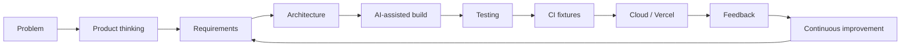
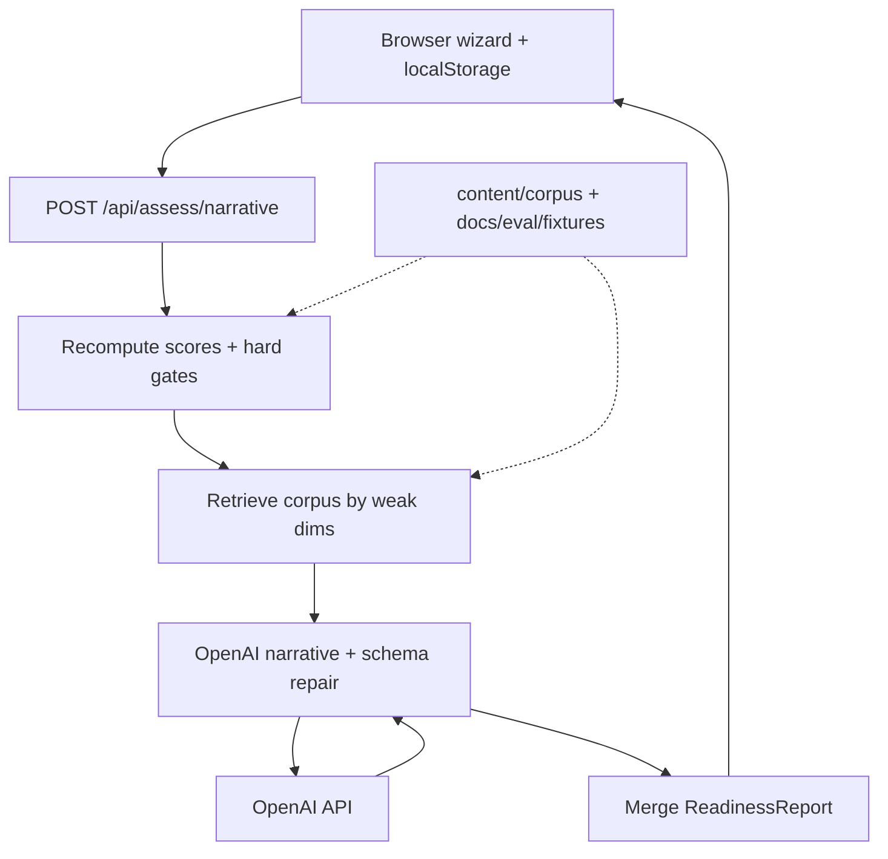
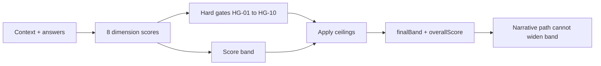
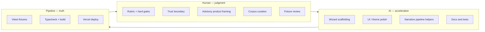
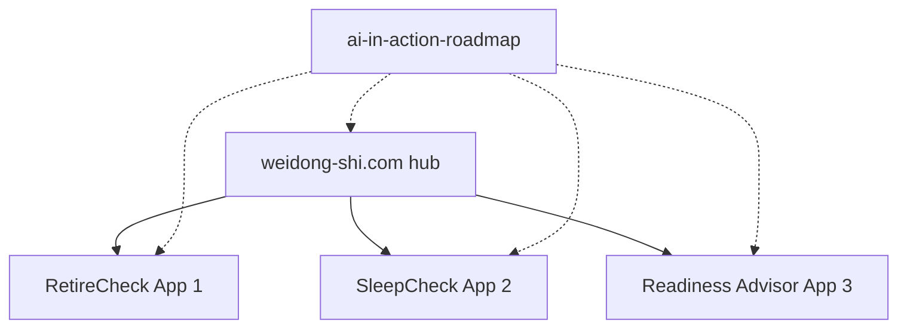

# AI Production Readiness Advisor — architecture

**Version:** `arch@0.2.0`  
**Status:** Live  

The live product is the demonstration; the engineering process — intent, boundaries, review, and shipping — is the durable product.

- **Live:** https://readiness.weidong-shi.com  
- **Hub case study:** https://weidong-shi.com/work/readiness  
- **Hub insight:** https://weidong-shi.com/insights/ai-in-action-readiness  
- **Source:** https://github.com/weidong808/ai-production-readiness-advisor  
- **Series roadmap:** https://github.com/weidong808/ai-in-action-roadmap  

> **Advisory disclaimer:** Not a certification, audit, or legal opinion. Scores and narrative are educational conversation starters for engineering, security, and compliance teams.

**One rule:** Scores and hard gates are deterministic and recomputed on the server; the model never sets the band.

---

## 1. Product journey

Every AI in Action application follows the same methodology: **Build → Validate → Improve → Document → Share**.

| Stage | Readiness focus |
|--------|------------------|
| Problem | AI features ship faster than teams can answer “ready for production?” |
| Product thinking | Advisory assessment — bands + hard gates, not a compliance stamp |
| Requirements | Eight dimensions, HG-01…HG-10, browser-held answers, degraded scores-only mode |
| Architecture | Deterministic scoring in code; OpenAI narrative behind a trust boundary |
| AI-assisted build | Wizard, corpus, narrative pipeline inside written constraints |
| Testing | Scoring + hard-gate fixtures, narrative schema/injection fixtures |
| CI / Cloud | Vitest + typecheck + build; Vercel + readiness.weidong-shi.com |
| Feedback | Sample report cold-start, theme/chrome parity, fixture expansion |
| Continuous improvement | Roadmap-driven polish — not “add another model feature” |

---

## 2. System architecture

*One rule: scores and hard gates are deterministic and recomputed on the server; the model never sets the band.*

Source diagram: [`../readiness-architecture.svg`](../readiness-architecture.svg)

### Key modules

| Module | Responsibility |
|--------|----------------|
| `src/lib/scoring/` | Dimension scores, bands, hard gates HG-01…HG-10 |
| `src/lib/schema/` | Zod types for report + LLM narrative subset |
| `src/lib/corpus/` | Load + keyword retrieve chunks by weak dimensions |
| `src/lib/ai/` | Provider adapter, prompt registry, caps, merge, repair |
| `src/lib/security/` | Delimiters, redaction helpers, blocklist |
| `src/app/api/assess/narrative` | Orchestration route |
| `src/components/AssessmentWizard.tsx` | Guided UX + local persistence |
| `src/lib/sample/` | Pre-generated sample report (zero OpenAI cost) |

### Trust model

- Client may send answers; server **recomputes** scores/gates (never trusts client band).
- Model cannot change `finalBand` / `overallScore`.
- Citations resolved server-side from corpus IDs only.
- On missing key, schema failure after one repair, or rate limit → scores-only report.

### Scoring / hard gates

Supporting diagram: [`../diagram-scoring-gates.svg`](../diagram-scoring-gates.svg)

### Persistence

| Data | Where |
|------|-------|
| In-progress assessment | Browser `localStorage` |
| Finished report | Browser (+ Markdown / JSON / print export) |
| API keys | Server env only |
| Corpus + fixtures | Git |

### Non-goals

- Shared monorepo with SleepCheck / RetireCheck  
- Multi-tenant auth or org workspaces  
- Streaming tool-calling agents  
- Fetching arbitrary customer URLs  
- Certification / paid compliance workflows  

---

## 3. Human vs AI responsibilities

| Role | Owns |
|------|------|
| **Human** | Rubric, hard-gate ceilings, trust model, advisory boundary, corpus selection, fixture intent, security redaction policy |
| **AI (Cursor)** | Component iteration, layout polish, pipeline wiring, docs/tests inside those constraints |
| **Pipeline** | Scoring/hard-gate/narrative fixtures, typecheck, production build, Vercel preview/production |

Supporting diagram: [`../diagram-human-ai.svg`](../diagram-human-ai.svg)

Philosophy: AI changes **where** engineers spend time. The app is the demo; the process is the product.

---

## 4. Platform — AI in Action series

Readiness is **#3** in a portfolio of production case studies under one parent brand.

### Shared series patterns

- Parent brand chrome and hub linking (`brand.ts` / site case studies)
- Methodology: **Build → Validate → Improve → Document → Share**
- Production URLs under `*.weidong-shi.com`
- Intent-driven AI workflow: rules before prompts, human review, ship for real

### Deliberate divergence

| | RetireCheck | SleepCheck | Readiness |
|---|-------------|------------|-----------|
| Core risk | Incorrect financial math | Audio glitches / broken calm UX | Inflated readiness / false certification |
| Architecture | Pure C# domain + API | Browser Web Audio + local storage | Deterministic scoring + advisory LLM |
| Auth / data | Stateless API calls | No accounts; device-local prefs | Browser-held answers; transient server |
| Deploy | Vercel + Render | Vercel PWA | Vercel |

Same series thesis, domain-appropriate architecture.

---

## Related links

- Live app: https://readiness.weidong-shi.com  
- Sample report: https://readiness.weidong-shi.com/sample  
- Hub case study: https://weidong-shi.com/work/readiness  
- Hub insight: https://weidong-shi.com/insights/ai-in-action-readiness  
- SleepCheck: https://sleepcheck.weidong-shi.com  
- RetireCheck: https://retirecheck.weidong-shi.com  
- Roadmap: https://github.com/weidong808/ai-in-action-roadmap  
